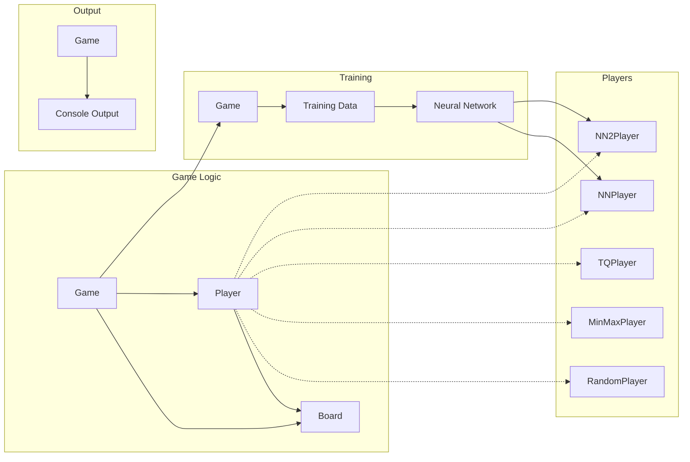

## Tic-Tac-Toe Game Architecture

**Timestamp:** 2023-10-27T14:32:14.889587

This diagram represents a high-level architecture for the Tic-Tac-Toe game codebase.

**Explanation:**

* **Game Logic:**
    * **Game:** Manages the game flow, including player turns, move validation, and win/draw detection.
    * **Board:** Represents the game board, storing the state of each cell and providing methods for checking winning conditions and drawing the board.
    * **Player:** Abstract base class for different player strategies.
* **Players:**
    * **RandomPlayer:** Makes random moves.
    * **MinMaxPlayer:** Uses the minimax algorithm to find the optimal move.
    * **TQPlayer:** Implements a tabular Q-learning algorithm to learn optimal moves.
    * **NNPlayer:** Uses a neural network to learn optimal moves.
    * **NN2Player:** Uses a different neural network architecture compared to NNPlayer.
* **Training:**
    * **Training Data:** Generated from game simulations to train the neural networks.
    * **Neural Network:** Learns from the training data to improve the player's strategy.
* **Output:**
    * **Console Output:** Displays the game state and results.

**Key Points:**

* The codebase is organized around the core game logic, with different player strategies implemented as separate classes.
* The training process is separate from the game logic, allowing for flexible training and evaluation.
* The use of neural networks for player strategies introduces machine learning capabilities.

**Repo:** thms/tic-tac-toe 
