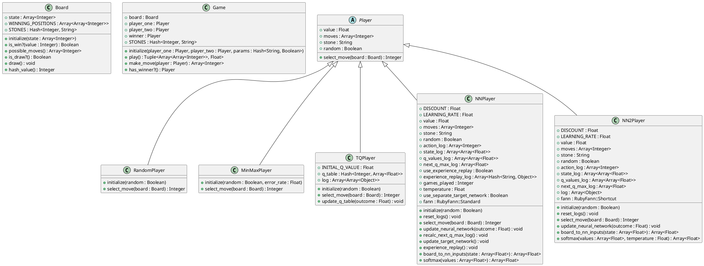

**Explanation:**

* **Board:** Represents the game board with its state, winning positions, and methods for checking win conditions, possible moves, and drawing the board.
* **Game:** Manages the game flow, including player turns, move execution, and determining the winner.
* **Player:** Abstract class defining the common interface for all player types.
* **RandomPlayer:** A player that makes random moves.
* **MinMaxPlayer:** A player that uses the minimax algorithm to make optimal moves.
* **TQPlayer:** A player that learns using a tabular Q-function, storing Q-values in a hash table.
* **NNPlayer:** A player that learns using a neural network to approximate the Q-function.
* **NN2Player:** A player that learns using a neural network with a different topology than NNPlayer.

**Relationships:**

* **Inheritance:** RandomPlayer, MinMaxPlayer, TQPlayer, NNPlayer, and NN2Player inherit from the abstract Player class.
* **Association:** Game has associations with two Player objects (player_one and player_two) and a Board object.
* **Aggregation:** Board aggregates an array of integers representing the board state.

**Data Model:**

* **Board:**
    * `state`: An array of integers representing the board state. Each element corresponds to a position on the board, with 0 representing an empty position, 1 representing a player's stone, and -1 representing the opponent's stone.
    * `WINNING_POSITIONS`: A list of arrays representing winning combinations of positions on the board.
    * `STONES`: A hash mapping integer values to string representations of the stones (e.g., 1.0 -> 'x', -1.0 -> 'o', 0 -> ' ').
* **Game:**
    * `board`: The game board.
    * `player_one`: The first player.
    * `player_two`: The second player.
    * `winner`: The player who wins the game, or null if the game is a draw.
    * `STONES`: A hash mapping integer values to string representations of the stones (e.g., 1.0 -> 'x', -1.0 -> 'o', 0 -> ' ').
* **Player:**
    * `value`: The player's value (1.0 for the first player, -1.0 for the second player).
    * `moves`: A list of the player's moves.
    * `stone`: The player's stone (e.g., 'x' or 'o').
    * `random`: A boolean indicating whether the player makes random moves.
* **TQPlayer:**
    * `INITIAL_Q_VALUE`: The initial value for all Q-values in the Q-table.
    * `q_table`: A hash table mapping board states (represented as integers) to arrays of Q-values for each possible move.
    * `log`: A list of tuples representing the player's moves and the corresponding board states.
* **NNPlayer:**
    * `DISCOUNT`: The discount factor used in the Q-learning update rule.
    * `LEARNING_RATE`: The learning rate used in the neural network training.
    * `fann`: A RubyFann::Standard object representing the neural network.
    * `action_log`: A list of the player's moves.
    * `state_log`: A list of the board states encountered during the game.
    * `q_values_log`: A list of the Q-values predicted by the neural network for each board state.
    * `next_q_max_log`: A list of the maximum Q-values for the next state after each move.
    * `use_experience_replay`: A boolean indicating whether to use experience replay during training.
    * `experience_replay_log`: A list of game experiences used for experience replay.
    * `games_played`: The number of games played.
    * `temperature`: The temperature parameter used in the softmax function.
    * `use_separate_target_network`: A boolean indicating whether to use a separate target network for stability.
* **NN2Player:**
    * `DISCOUNT`: The discount factor used in the Q-learning update rule.
    * `LEARNING_RATE`: The learning rate used in the neural network training.
    * `fann`: A RubyFann::Shortcut object representing the neural network.
    * `action_log`: A list of the player's moves.
    * `state_log`: A list of the board states encountered during the game.
    * `q_values_log`: A list of the Q-values predicted by the neural network for each board state.
    * `next_q_max_log`: A list of the maximum Q-values for the next state after each move.
    * `log`: A list of objects used for logging training data.

This data model provides a comprehensive representation of the codebase, including the relationships between different classes and the data structures used for learning and game play.
